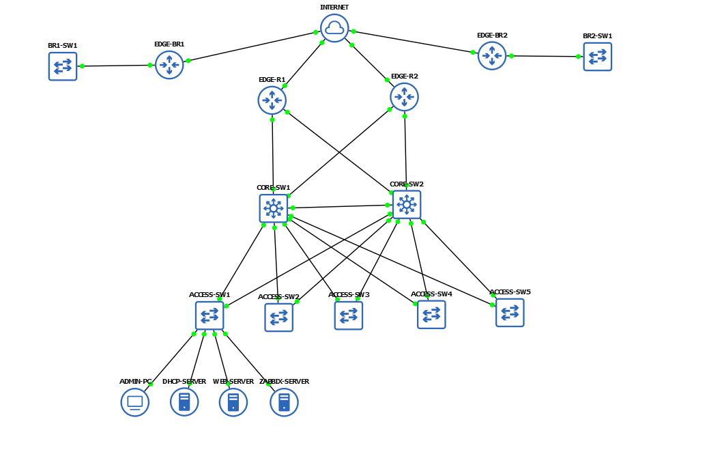
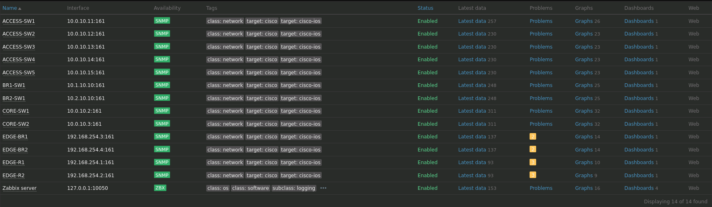
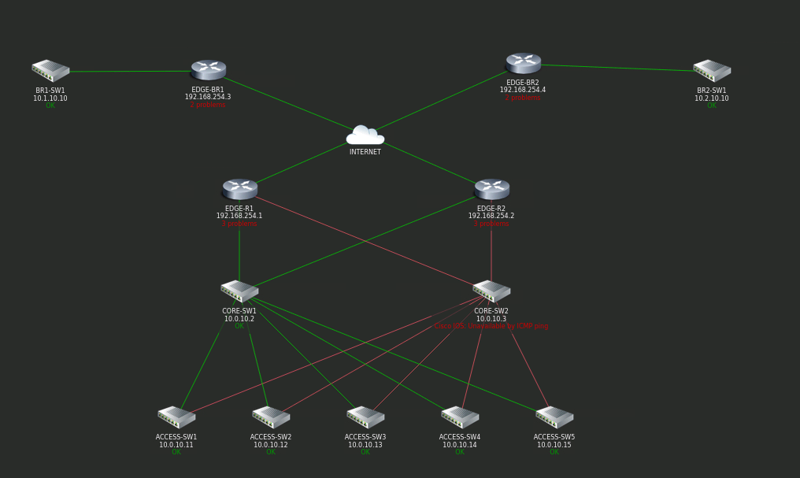

## Wprowadzenie i Opis Projektu
Projekt obejmuje wykonanie projektu logicznego oraz konfiguracji infrastruktury sieciowej dla Centrali (HQ) oraz dwóch oddziałów zamiejscowych (Branch 1 i Branch 2). Środowisko zostało zaprojektowane 
pod kątem zapewnienia bezpiecznej komunikacji między lokalizacjami oraz pełnego monitoringu urządzeń z wykorzystaniem urządzeń Cisco oraz usług serwerowych: centralnego serwera DHCP (isc-dhcp-server) wdrożonego na systemie Debian 12 
oraz systemu monitorowania Zabbix wraz z demonem SNMP Traps (snmptrapd) działającego na systemie Ubuntu Server. Całość projektu została zrealizowana i przetestowana w środowisku symulacyjnym GNS3.
## Topologia i Plan Adresacji IP
### 1. Schemat Topologii Sieci
Struktura logiczna oraz fizyczne połączenia pomiędzy urządzeniami zrealizowane w środowisku GNS3:

---
### 2. Plan Adresacji IP — Centrala (HQ)
#### Konwencja Adresowania Interfejsów L3 (SVI):
Dla każdej podsieci użytkowej i serwerowej w Centrali (VLAN 10 do 110) obowiązuje maska `255.255.255.0 (/24)` oraz stały schemat końcówek IP:
* **.1** -> HSRP Virtual IP (Brama domyślna dla stacji roboczych/urządzeń)
* **.2** -> CORE-SW1 (Fizyczny adres IP interfejsu SVI)
* **.3** -> CORE-SW2 (Fizyczny adres IP interfejsu SVI)
#### Tabela podsieci, rozdziału adresów oraz ról HSRP w Centrali:

| VLAN | Nazwa sieci | Podsieć IP | CORE-SW1 IP | CORE-SW2 IP | HSRP Virtual IP | Aktywny Core |
| :---: | :--- | :--- | :--- | :--- | :--- | :--- |
| **10** | MGMT | `10.0.10.0/24` | `10.0.10.2` | `10.0.10.3` | `10.0.10.1` | CORE-SW1 |
| **15** | IT_DEPT | `10.0.15.0/24` | `10.0.15.2` | `10.0.15.3` | `10.0.15.1` | CORE-SW1 |
| **20** | SW1_USERS | `10.0.20.0/24` | `10.0.20.2` | `10.0.20.3` | `10.0.20.1` | CORE-SW1 |
| **21** | SW1_VOIP | `10.0.21.0/24` | `10.0.21.2` | `10.0.21.3` | `10.0.21.1` | CORE-SW1 |
| **30** | SW2_USERS | `10.0.30.0/24` | `10.0.30.2` | `10.0.30.3` | `10.0.30.1` | CORE-SW2 |
| **31** | SW2_VOIP | `10.0.31.0/24` | `10.0.31.2` | `10.0.31.3` | `10.0.31.1` | CORE-SW2 |
| **40** | SW3_USERS | `10.0.40.0/24` | `10.0.40.2` | `10.0.40.3` | `10.0.40.1` | CORE-SW1 |
| **41** | SW3_VOIP | `10.0.41.0/24` | `10.0.41.2` | `10.0.41.3` | `10.0.41.1` | CORE-SW1 |
| **50** | SW4_USERS | `10.0.50.0/24` | `10.0.50.2` | `10.0.50.3` | `10.0.50.1` | CORE-SW2 |
| **51** | SW4_VOIP | `10.0.51.0/24` | `10.0.51.2` | `10.0.51.3` | `10.0.51.1` | CORE-SW2 |
| **60** | SW5_USERS | `10.0.60.0/24` | `10.0.60.2` | `10.0.60.3` | `10.0.60.1` | CORE-SW1 |
| **61** | SW5_VOIP | `10.0.61.0/24` | `10.0.61.2` | `10.0.61.3` | `10.0.61.1` | CORE-SW1 |
| **100** | SERVERS | `10.0.100.0/24` | `10.0.100.2` | `10.0.100.3` | `10.0.100.1` | CORE-SW1 |
| **110** | PRINTERS | `10.0.110.0/24` | `10.0.110.2` | `10.0.110.3` | `10.0.110.1` | CORE-SW2 |
| **90** | GUEST | `10.0.90.0/24` | `10.0.90.2` | `10.0.90.3` | `10.0.90.1` | CORE-SW2 |
| **999** | NATIVE | `10.0.99.0/24` | --- | --- | --- | L2 Only |

#### Adresacja interfejsów zarządzania (SVI) dla switchy dostępowych (VLAN 10):

| Urządzenie | Adres IP | Maska sieci | Brama domyślna (Default Gateway) |
| :--- | :--- | :--- | :--- |
| **ACCESS_SW1** | `10.0.10.11` | `255.255.255.0` | `10.0.10.1` |
| **ACCESS_SW2** | `10.0.10.12` | `255.255.255.0` | `10.0.10.1` |
| **ACCESS_SW3** | `10.0.10.13` | `255.255.255.0` | `10.0.10.1` |
| **ACCESS_SW4** | `10.0.10.14` | `255.255.255.0` | `10.0.10.1` |
| **ACCESS_SW5** | `10.0.10.15` | `255.255.255.0` | `10.0.10.1` |

---

### 3. Plan Adresacji IP — Oddziały (Branches)

#### ODDZIAŁ 1

| Nazwa VLAN | Numer VLAN | Adres sieci | Maska sieci | Brama domyślna |
| :--- | :---: | :--- | :--- | :--- |
| **MGMT** | 10 | `10.1.10.0` | `255.255.255.0` | `10.1.10.1` |
| **USERS** | 20 | `10.1.20.0` | `255.255.255.0` | `10.1.20.1` |
| **LOCAL** | 30 | `10.1.30.0` | `255.255.255.0` | `10.1.30.1` |
| **GUEST** | 40 | `10.1.40.0` | `255.255.255.0` | `10.1.40.1` |
| **IT** | 50 | `10.1.50.0` | `255.255.255.0` | `10.1.50.1` |
| **VOIP** | 60 | `10.1.60.0` | `255.255.255.0` | `10.1.60.1` |

* **Adres IP interfejsu zarządzania (VLAN 10) dla BR1-SW1:** `10.1.10.10`

#### ODDZIAŁ 2

| Nazwa VLAN | Numer VLAN | Adres sieci | Maska sieci | Brama domyślna |
| :--- | :---: | :--- | :--- | :--- |
| **MGMT** | 10 | `10.2.10.0` | `255.255.255.0` | `10.2.10.1` |
| **USERS** | 20 | `10.2.20.0` | `255.255.255.0` | `10.2.20.1` |
| **LOCAL** | 30 | `10.2.30.0` | `255.255.255.0` | `10.2.30.1` |
| **GUEST** | 40 | `10.2.40.0` | `255.255.255.0` | `10.2.40.1` |
| **IT** | 50 | `10.2.50.0` | `255.255.255.0` | `10.2.50.1` |
| **VOIP** | 60 | `10.2.60.0` | `255.255.255.0` | `10.2.60.1` |

* **Adres IP interfejsu zarządzania (VLAN 10) dla BR2-SW1:** `10.2.10.10`

---

### 4. Adresacja Połączeń Infrastrukturalnych i WAN

#### Adresacja pomiędzy warstwą EDGE - CORE (Centrala):

| ROUTER | SWITCH | Adres sieci | ADRES ROUTERA | ADRES SWITCHA |
| :--- | :--- | :--- | :--- | :--- |
| **EDGE-R1** | CORE-SW1 | `10.0.250.0/30` | `10.0.250.1` | `10.0.250.2` |
| **EDGE-R1** | CORE-SW2 | `10.0.250.4/30` | `10.0.250.5` | `10.0.250.6` |
| **EDGE-R2** | CORE-SW1 | `10.0.250.8/30` | `10.0.250.9` | `10.0.250.10` |
| **EDGE-R2** | CORE-SW2 | `10.0.250.12/30` | `10.0.250.13` | `10.0.250.14` |

#### Adresacja WAN:

| ROUTER | WAN ADDRESS |
| :--- | :--- |
| **EDGE-R1** | `192.51.100.1/30` |
| **EDGE-R2** | `192.51.100.5/30` |
| **EDGE-BR1** | `192.51.100.9/30` |
| **EDGE-BR2** | `192.51.100.13/30` |

#### Adresacja interfejsów Loopback na routerach:

| ROUTER | LOOPBACK ADDRESS |
| :--- | :--- |
| **EDGE-R1** | `192.168.254.1` |
| **EDGE-R2** | `192.168.254.2` |
| **EDGE-BR1** | `192.168.254.3` |
| **EDGE-BR2** | `192.168.254.4` |

#### Adresacja interfejsów Tunnel (VPN):
*Pierwszy adres w sieci jest przydzielony do routera w HQ, a drugi adres dla routera Branch.*

| ROUTER (HQ) | ROUTER (BRANCH) | Sieć | IP HQ | IP BRANCH |
| :--- | :--- | :--- | :--- | :--- |
| **EDGE-R1** | EDGE-BR1 | `10.255.0.0/30` | `10.255.0.1` | `10.255.0.2` |
| **EDGE-R1** | EDGE-BR2 | `10.255.0.4/30` | `10.255.0.5` | `10.255.0.6` |
| **EDGE-R2** | EDGE-BR1 | `10.255.0.8/30` | `10.255.0.9` | `10.255.0.10` |
| **EDGE-R2** | EDGE-BR2 | `10.255.0.12/30` | `10.255.0.13` | `10.255.0.14` |

## Konfiguracja Warstwy Dostępowej (Access Layer) w Centrali

Wszystkie przełączniki dostępowe (`ACCESS_SW1` do `ACCESS_SW5` w Centrali) działają w warstwie 2 (Layer 2). Odpowiadają za fizyczne podłączenie urządzeń końcowych, komputerów, telefonów oraz serwerów, realizując przy tym mechanizmy izolacji i bezpieczeństwa na poziomie portów.

### 1. Struktura i Przypisanie VLAN-ów do Przełączników (HQ)

Konfiguracja sieci VLAN na poszczególnych przełącznikach dostępowych została podzielona w następujący sposób:

*   **ACCESS_SW1 (Główny Przełącznik Dostępów / Serwerownia & Sekcja A):**
    *   **VLAN 10 (MGMT):** Sieć zarządcza dla infrastruktury.
    *   **VLAN 15 (IT_DEPT):** Podsieć dla stacji roboczych administratorów (w tym `ADMIN-PC`).
    *   **VLAN 20 (SW1_USERS):** Ruch komputerowy pierwszej grupy pracowników.
    *   **VLAN 21 (SW1_VOIP):** Ruch dla aparatów VoIP pierwszej grupy pracowników.
    *   **VLAN 100 (SERVERS):** Krytyczna strefa serwerowa (`DHCP-SERVER`, `WEB-SERVER`, `ZABBIX-SERVER`, `VOIP-GATEWAY`).
    *   **VLAN 110 (PRINTERS):** Centralna strefa sieciowych urządzeń drukujących.

*   **ACCESS_SW2 do ACCESS_SW5 (Przełączniki dla Sekcji Użytkowników, Gości i Drukarek):**
    Każdy z pozostałych przełączników dostępowych posiada analogiczny zestaw VLAN-ów, umożliwiający obsługę lokalnych pracowników, telefonii, ruchu gościnnego oraz dostęp do urządzeń drukujących i sieci zarządzania:
    *   **VLAN 10 (MGMT):** Dostęp do wirtualnego interfejsu zarządzania danego switcha.
    *   **VLAN 110 (PRINTERS):** Lokalny dostęp do sieciowych drukarek korporacyjnych.
    *   **VLAN 90 (GUEST):** Ruch odizolowanej sieci bezprzewodowej/przewodowej dla gości.
    *   **VLAN-y Użytkowe i VoIP (Dedykowane per Switch):**
        *   Na **ACCESS_SW2**: `VLAN 30` (SW2_USERS) oraz `VLAN 31` (SW2_VOIP)
        *   Na **ACCESS_SW3**: `VLAN 40` (SW3_USERS) oraz `VLAN 41` (SW3_VOIP)
        *   Na **ACCESS_SW4**: `VLAN 50` (SW4_USERS) oraz `VLAN 51` (SW4_VOIP)
        *   Na **ACCESS_SW5**: `VLAN 60` (SW5_USERS) oraz `VLAN 61` (SW5_VOIP)

---

### 2. Bezpieczeństwo DHCP (DHCP Snooping)
W celu ochrony sieci LAN przed nieautoryzowanymi lub złośliwymi serwerami DHCP (ataki typu *Rogue DHCP Server*), na wszystkich przełącznikach dostępowych aktywowano funkcję **DHCP Snooping**:
*   **Porty Zaufane (Trusted Ports):** Fizyczne porty uplink prowadzące w stronę przełączników rdzeniowych `CORE-SW1` i `CORE-SW2` (oraz interfejs podłączenia serwera DHCP na `ACCESS_SW1`) zostały skonfigurowane jako zaufane (`ip dhcp snooping trust`). Tylko przez te porty dopuszczalne jest przesyłanie pakietów typu *DHCP Offer* oraz *DHCP Ack*.
*   **Porty Niezaufane (Untrusted Ports):** Wszystkie porty abonenckie dla użytkowników końcowych, telefonów oraz gości są domyślnie niezaufane. Wpięcie fałszywego serwera DHCP w jakiekolwiek gniazdo biurkowe skutkuje natychmiastowym zablokowaniem nieautoryzowanych pakietów konfiguracyjnych, chroniąc sieć przed paraliżem adresacji.
*   **Włączenie globalne:** Mechanizm został uruchomiony globalnie (`ip dhcp snooping`) i powiązany ze wszystkimi obsługiwanymi VLAN-ami.

---

### 3. Mechanizmy Warstwy Dostępowej (L2 Features)

#### Porty Dostępowe (Access Mode) i Dual-VLAN dla VoIP
*   Wszystkie porty abonenckie zostały na sztywno przełączone w tryb dostępowy (`switchport mode access`).
*   W miejscach pracy wymagających jednoczesnego podłączenia PC oraz aparatu telefonicznego wdrożono technologię **Dual-VLAN**. Przełącznik przesyła pakiety komputera jako nietagowane w dedykowanym VLAN-ie użytkowników (np. `VLAN 30`), a ruch telefoniczny automatycznie taguje i odseparowuje w skorelowanym VLAN-ie VoIP (np. `VLAN 31`) za pomocą komendy `switchport voice vlan [ID]`.

#### Trunking i Bezpieczeństwo Native VLAN (802.1Q)
*   Uplinki do przełączników rdzeniowych działają jako magistrale trunk (`switchport mode trunk`) w standardzie tagowania IEEE 802.1Q.
*   W celu zabezpieczenia sieci przed atakami klasy *VLAN Hopping*, domyślny `VLAN 1` został całkowicie wyłączony z obsługi przesyłu danych. Cały ruch nietagowany (np. ramki kontrolne protokołów L2) został przeniesiony do odizolowanego, nieużywanego produkcyjnie VLAN-u natywnego za pomocą komendy `switchport trunk native vlan 999`.

#### Optymalizacja i Ochrona Topologii STP (Spanning Tree)
*   **PortFast:** Uruchomiony na portach końcowych (Edge Ports). Pomija stany listening/learning, natychmiast podnosząc interfejs w stan `Forwarding` po podłączeniu kabla, co eliminuje problemy z czasem oczekiwania (timeout) stacji na adres IP z DHCP.
*   **BPDU Guard:** Funkcja ochronna powiązana z PortFast. Podłączenie do gniazda ściennego nieautoryzowanego switcha generującego ramki BPDU skutkuje natychmiastowym wprowadzeniem portu w stan awaryjny `err-disabled`, zapobiegając pętlom i destabilizacji drzewa STP.
*   **BPDU Filter:** Funkcja która pozwala wyłączyć przesyłanie pakietów BPDU, została włączona na portach do której wpięte są urządzenia końcowe.

#### Dostęp Zdalny i Zarządzanie (Management Plane)
*   **Wirtualny interfejs SVI (VLAN 10):** Każdy przełącznik posiada skonfigurowany adres IP w dedykowanym `VLAN 10 MGMT` do celów administracyjnych. Do poprawnego routingu ruchu zarządzającego poza sieć lokalną skonfigurowano bramę domyślną (`ip default-gateway 10.0.10.1`) kierującą na wirtualny adres bramy HSRP.
*   **Protokół Telnet zamiast SSH:** Dostęp zdalny do CLI przełączników został skonfigurowany z wykorzystaniem protokołu **Telnet**. Decyzja ta wynikała bezpośrednio z ograniczeń technicznych środowiska symulacyjnego GNS3 — zastosowane obrazy IOU (IOS on Unix) dla przełączników L2 nie posiadały wsparcia dla kryptografii i nie obsługiwały protokołu SSH. W środowisku produkcyjnym bezwzględnie zalecane jest stosowanie protokołu SSH, ponieważ Telnet przesyła dane (w tym hasła) otwartym tekstem, podczas gdy SSH zapewnia w pełni szyfrowaną i bezpieczną komunikację.
*   **Zabezpieczenie linii VTY za pomocą ACL:** Pomimo ograniczeń protokołu Telnet, płaszczyzna zarządzania została maksymalnie zabezpieczona na poziomie kontroli dostępu. Do linii wirtualnych (`line vty 0 4`) przypisano listę kontrolną za pomocą komendy `access-class TELNET-ACCESS in`. Ta lista ACL restrykcyjnie ogranicza możliwość nawiązania sesji zdalnej, zezwalając na dostęp do CLI switcha wyłącznie zautoryzowanym podsieciom działu IT:
    *   `10.0.15.0/24` (Sieć IT w Centrali)
    *   `10.1.50.0/24` (Sieć IT w Oddziale 1)
    *   `10.2.50.0/24` (Sieć IT w Oddziale 2)

## Konfiguracja Warstwy Rdzeniowej (Core Layer) w Centrali

Warstwa rdzeniowa opiera się na dwóch przełącznikach warstwy 3 (`CORE-SW1` oraz `CORE-SW2`). Realizują one routing lokalny, dynamiczny, dystrybucję DHCP oraz wymuszają bezpieczeństwo i wysoką dostępność.

### 1. Inter-VLAN Routing i Obsługa DHCP
*   **Routing IP:** Globalnie włączono funkcję `ip routing`. Przełączniki realizują routing międzyvlanowy (Inter-VLAN Routing) bezpośrednio na interfejsach wirtualnych SVI.
*   **DHCP Relay Agent:** Na interfejsach SVI skonfigurowano komendę `ip helper-address 10.0.100.10`. Przekazuje ona lokalne rozgłoszenia DHCP (VLAN-ów użytkowników, gości i VoIP) bezpośrednio do serwera Debian.

### 2. Synchronizacja HSRP oraz Spanning Tree (STP)
Wdrożono protokół **HSRP** do redundancji bram domyślnych i zsynchronizowano go z topologią **Spanning Tree (STP)**, aby urządzenia CORE pełniły rolę **Root Bridge** dla obsługiwanych przez siebie sieci. Zapobiega to asymetrycznemu routingowi i optymalizuje ścieżki pakietów:
*   **CORE-SW1 (Primary Root Bridge / HSRP Active):** Konfiguracja `spanning-tree vlan [ID] root primary` oraz priorytet HSRP 110 (z włączonym wywłaszczaniem `preempt`) dla sieci: `VLAN 10` (MGMT), `VLAN 15` (IT), `VLAN 20/21` (SW1), `VLAN 40/41` (SW3), `VLAN 60/61` (SW5) oraz `VLAN 100` (SERVERS).
*   **CORE-SW2 (Primary Root Bridge / HSRP Active):** Konfiguracja `spanning-tree vlan [ID] root primary` oraz priorytet HSRP 110 (z włączonym wywłaszczaniem `preempt`) dla sieci: `VLAN 30/31` (SW2), `VLAN 50/51` (SW4), `VLAN 90` (GUEST) oraz `VLAN 110` (PRINTERS).
*   **STP Root Guard:** Na portach magistralnych (Trunk) łączących przełączniki rdzeniowe z przełącznikami dostępowymi włączono funkcję **Root Guard**. Gwarantuje ona, że żadne urządzenie w warstwie dostępowej nie przejmie roli głównego węzła (Root Bridge) w topologii STP, co zabezpiecza stabilność całej sieci przed nieautoryzowanymi zmianami.

### 3. Routing Dynamiczny (OSPF)
*   **Obszar Area 0:** `CORE-SW1` i `CORE-SW2` zestawiają sąsiedztwo OSPF z routerami brzegowymi `EDGE-R1/R2` przez dedykowane sieci `/30` (`10.0.250.0/24`).
*   **Rozgłaszanie sieci:** Oba przełączniki Core ogłaszają swoje sieci SVI, dając routerom brzegowym pełną wiedzę o adresacji HQ. Interfejsy klienckie zabezpieczono komendą `passive-interface`.

### 4. Podsumowanie List Kontroli Dostępu (ACL)
*   **`SEC-GUEST` (Całkowita Izolacja Gości - Kierunek `in`):** Lista restrykcyjnie izoluje sieć gości (`10.0.90.0/24`). Zezwala wyłącznie na ruch DHCP do serwera (`10.0.100.10`) w celu pobrania adresacji, a następnie całkowicie blokuje (Deny) jakikolwiek ruch do wszystkich prywatnych sieci korporacyjnych (`10.0.0.0/8`, `172.16.0.0/12`, `192.168.0.0/16`). Ostatnia linia puszcza ruch wyłącznie na zewnątrz, dając gościom jedyny dostęp do Internetu.
*   **`SEC-USERS` (Kontrola Ruchu Użytkowników - Kierunek `in`):** Pozwala pracownikom na dostęp wyłącznie do niezbędnych usług centralnych (serwer druku TCP 9100, DHCP do Debiana, WWW/HTTPS do serwera aplikacji `10.0.100.11`), po czym całkowicie odcina i blokuje im dostęp do pozostałych sieci prywatnych firmy (`10.0.0.0/8`, `172.16.0.0/12`, `192.168.0.0/16`). Linia `permit ip any any` na końcu otwiera wyjście do Internetu.
*   **`SEC-VOIP` (Kierunek `in`):** Otwiera sygnalizację SIP do centrali `10.0.100.20` oraz bezpośredni ruch audio RTP (porty 16384-32767) precyzyjnie pomiędzy wyznaczonymi podsieciami głosowymi Centrali i Oddziałów (komunikacja *SIP Direct Media*). Pozostały ruch RFC 1918 jest zablokowany.
*   **`SEC-SERVERS` & `SEC-PRINTERS` (Filtry Zasobów):** Zezwalają na pełen dostęp dla podsieci IT Centrali i Oddziałów. Ograniczają ruch serwera monitoringu **Zabbix (10.0.100.12)** do SNMP/Traps z autoryzowanych interfejsów (w tym Loopbacków routerów `192.168.254.1-4` i switchy dostępowych `10.1.10.10` / `10.2.10.10`) oraz blokują skanowanie drukarek poza portem `TCP 9100`.
*   **`SEC-MGMT` (Ochrona Zarządzania):** Zezwala na pełną komunikację IP wyłącznie z podsieci IT Centrali i Oddziałów oraz ruch SNMP/ICMP z serwera Zabbix, odrzucając próby połączeń ze wszystkich innych stref.

## Konfiguracja Warstwy Brzegowej (Edge Layer) i połączeń WAN

Warstwa brzegowa odpowiada za bezpieczną łączność międzyoddziałową (Centrala <-> Oddziały) poprzez publiczną sieć Internet oraz translację adresów dla ruchu wychodzącego na świat. Składa się z routerów `EDGE-R1` i `EDGE-R2` w Centrali oraz routerów `EDGE-BR1` i `EDGE-BR2` w oddziałach zamiejscowych.

### 1. Bezpieczna łączność WAN (Szyfrowane tunele GRE over IPsec)
W celu bezpiecznego połączenia Centrali z Oddziałami przez publiczną przestrzeń adresową WAN, pomiędzy routerami brzegowymi skonfigurowano tunele VPN w architekturze **GRE over IPsec**:
*   **Tunele GRE (Generic Routing Encapsulation):** Zostały uruchomione jako interfejsy wirtualne (`interface Tunnel0` itp.) i zaadresowane w podsieciach `/30` z zakresu `10.255.0.0/24`. Tunele te umożliwiają przesyłanie ruchu rozgłoszeniowego (Broadcast/Multicast) oraz pakietów protokołów routingu pomiędzy lokalizacjami.
*   **Szyfrowanie IPsec:** Cały ruch przechodzący przez instancje GRE został zabezpieczony profilami kryptograficznymi IPsec. Zapewnia to pełną poufność, integralność oraz uwierzytelnianie danych krążących w sieci rozległej między Centralą a routerami `EDGE-BR1` i `EDGE-BR2`.
*   **Redundancja połączeń:** Każdy z routerów w oddziałach posiada niezależne tunele do obu routerów w centrali (`EDGE-R1` oraz `EDGE-R2`), co gwarantuje ciągłość działania komunikacji WAN w przypadku awarii jednego z urządzeń brzegowych w HQ.

### 2. Routing Dynamiczny WAN (OSPF w Area 0)
Wymiana informacji o trasach pomiędzy Centralą a Oddziałami odbywa się w sposób dynamiczny z wykorzystaniem protokołu **OSPF (Process ID 1)**:
*   **Pełna integracja w Area 0:** Wszystkie interfejsy tunelowe (VPN) oraz interfejsy wirtualne **Loopback (192.168.254.1-4)** routerów brzegowych zostały włączone do głównego obszaru `area 0`.
*   **Wymiana tras międzysieciowych:** Poprzez tunele VPN routery w oddziałach ogłaszają swoje lokalne VLAN-y (użytkownicy, goście, IT, VoIP), a routery w Centrali przekazują dalej sieci rozgłaszane przez przełączniki rdzeniowe CORE-SW. Dzięki temu cała struktura sieciowa posiada dynamicznie aktualizowaną tablicę routingu.

### 3. Translacja Adresów (PAT - Port Address Translation)
Aby umożliwić użytkownikom, gościom oraz telefonom VoIP dostęp do publicznej sieci Internet, na zewnętrznych interfejsach fizycznych WAN wszystkich routerów EDGE skonfigurowano translację adresów:
*   **NAT Overload (PAT):** Ruch z wewnętrznych podsieci prywatnych firmy jest dynamicznie mapowany na pojedynczy, publiczny adres IP przypisany do interfejsu WAN routera.
*   **Wykluczenie ruchu VPN z NAT:** Za pomocą list kontroli dostępu (ACL) ruch skierowany przez tunele VPN do innych oddziałów lub Centrali został jawnie wykluczony z procesu translacji (NAT Bypass). Dzięki temu pakiety międzysieciowe zachowują swoją oryginalną, prywatną adresację IP podczas przesyłania wewnątrz tuneli GRE over IPsec.

### 4. Optymalizacja i stabilizacja połączeń (TCP MSS Tuning)
*   **ip tcp adjust-mss 1360:** Ze względu na dodatkowy narzut bajtów generowany przez nagłówki tuneli GRE oraz szyfrowanie IPsec, na wszystkich interfejsach tunelowych zastosowano mechanizm korekty rozmiaru segmentu TCP.
*   **Eliminacja fragmentacji:** Komenda ta wymusza na hostach końcowych obniżenie parametru MSS do 1360 bajtów już podczas nawiązywania sesji TCP (uścisk dłoni SYN/ACK). Zapobiega to przekraczaniu standardowego limitu MTU 1500 bajtów po dodaniu nagłówków VPN, co całkowicie wyeliminowało problem fragmentacji, gubienia dużych pakietów i przerw w działaniu aplikacji webowych oraz serwera monitoringu Zabbix.

## Konfiguracja Oddziałów Zamiejscowych (Branch Layer)

Konfiguracja urządzeń w Oddziale 1 (`EDGE-BR1`, `BR1-SW1`) oraz Oddziale 2 (`EDGE-BR2`, `BR2-SW1`) realizuje założenia lokalnej sieci LAN, zabezpieczeń L2/L3, ochrony brzegu oraz szyfrowanej komunikacji WAN. 

### 1. Lokalny Routing i Adresacja IP (Router-on-a-Stick — ROAS)
Ponieważ przełączniki w oddziałach działają wyłącznie w warstwie 2, zadanie routingu pomiędzy lokalnymi podsieciami zostało przeniesione na routery brzegowe:
*   **Inter-VLAN Routing:** Routery `EDGE-BR1` oraz `EDGE-BR2` zostały skonfigurowane w architekturze **Router-on-a-Stick (ROAS)**. Ruch pomiędzy lokalnymi sieciami (np. komputery pracowników a sieć IT czy VoIP) jest przekazywany i przełączany bezpośrednio przez router brzegowy.
*   **Podinterfejsy (Subinterfaces):** Główny interfejs fizyczny routera skierowany do sieci LAN został podzielony na logiczne podinterfejsy odpowiadające poszczególnym numerom VLAN (np. `interface GigabitEthernet0/1.20` dla VLAN 20).
*   **Tagowanie 802.1Q:** Na każdym podinterfejsie włączono obsługę tagowania ramek w standardzie IEEE 802.1Q (`encapsulation dot1Q [VLAN_ID]`) oraz przypisano właściwy adres IP pełniący funkcję lokalnej bramy domyślnej (`.1`).

### 2. Bezpieczna łączność WAN (GRE over IPsec do Centrali)
Z poziomu routerów oddziałowych zrealizowano szyfrowane połączenia do sieci rozległej:
*   **Kryptografia do Centrali:** Routery `EDGE-BR1` oraz `EDGE-BR2` zestawiają bezpieczne, szyfrowane tunele **GRE over IPsec** bezpośrednio do głównych routerów w Centrali (`EDGE-R1` oraz `EDGE-R2`).
*   **Filtrowanie ruchu tunelowego (ACL 101 & ACL 102):** Na zewnętrznych interfejsach WAN routerów oddziałowych wdrożono dedykowane listy rozszerzone kontrolujące ruch GRE. Zezwalają one na tunelowanie pakietów wyłącznie pomiędzy autoryzowanymi publicznymi adresami IP routerów brzegowych (np. z `192.51.100.9` do `192.51.100.1` dla `EDGE-R1` oraz do `192.51.100.5` dla `EDGE-R2`), odrzucając wszelkie inne próby manipulacji na porcie GRE z Internetu.

### 3. Implementacja Bezpieczeństwa w Oddziałach (Filtrowanie ACL)
Na podinterfejsach routerów brzegowych w oddziałach zaaplikowano rozszerzone listy kontroli dostępu, zabezpieczające ruch lokalny oraz międzysieciowy:

*   **`SEC-USERS` (Kontrola ruchu użytkowników oddziału):**
    *   *Lokalne drukowanie:* Zezwala na ruch do sieci lokalnej drukarek (`10.1.30.0/24` dla BR1) wyłącznie na dedykowany port `TCP 9100`.
    *   *Dostęp do serwerów Centrali:* Otwiera ruch webowy (`TCP 80` i `TCP 443`) do centralnego serwera aplikacji `10.0.100.11`.
    *   *Izolacja korporacyjna:* Bezwzględnie odcina i blokuje użytkownikom dostęp do wszystkich pozostałych sieci prywatnych w firmie (klasy RFC 1918: `10.0.0.0/8`, `172.16.0.0/12`, `192.168.0.0/16`).
    *   *Internet:* Przepuszcza pozostały ruch zewnętrzny na zewnątrz (`permit ip any any`).

*   **`SEC-GUEST` (Całkowita izolacja gości w oddziale):**
    *   Lista zapewnia restrykcyjne odcięcie sieci gościnnej. Natychmiast blokuje (Deny) jakikolwiek ruch skierowany do adresów prywatnych korporacji (`10.0.0.0/8`, `172.16.0.0/12`, `192.168.0.0/16`), a linia `permit ip any any` na końcu gwarantuje gościom wyłącznie bezpośrednie wyjście do Internetu.

*   **`SEC-MGMT` & `SEC-PRINTERS` (Ochrona zasobów oddziałowych):**
    *   Zezwalają na pełen, nieograniczony dostęp do zarządzania oraz drukarek wyłącznie dla autoryzowanych podsieci działu IT Centrali (`10.0.15.0/24`), Oddziału 1 (`10.1.50.0/24`) oraz Oddziału 2 (`10.2.50.0/24`).
    *   `SEC-MGMT` dopuszcza dodatkowo odpytywanie przez SNMP oraz diagnostyczny ICMP (ping) wyłącznie z centralnego serwera monitoringu **Zabbix (10.0.100.12)**.

*   **`SSH-ACCESS` / `TELNET-ACCESS` (Zabezpieczenie linii VTY):**
    *   Dostęp do linii wirtualnych switchów i routerów w oddziałach został ograniczony standardową listą kontrolną. Gwarantuje ona, że sesję administracyjną (Telnet na switchach, SSH na routerach) można otworzyć wyłącznie z komputerów inżynierów IT w firmie (`10.0.15.0/24`, `10.1.50.0/24`, `10.2.50.0/24`).

### 4. Konfiguracja i Bezpieczeństwo Przełączników Dostępowych (L2 Features)
Lokalne przełączniki dostępowe `BR1-SW1` oraz `BR2-SW1` odpowiadają za prawidłową separację ruchu oraz ochronę portów abonenckich:
*   **Podział na VLANy i Porty Access:** Wszystkie porty końcowe zostały na sztywno skonfigurowane w tryb dostępowy (`switchport mode access`) i przypisane do odpowiednich VLAN-ów (MGMT, USERS, LOCAL, GUEST, IT, VOIP).
*   **Dual-VLAN dla aparatów VoIP:** Porty biurkowe obsługują jednoczesny ruch komputera (nietagowany w VLAN 20) oraz ruch głosowy telefonu (automatycznie tagowany w VLAN 60) za pomocą komendy `switchport voice vlan 60`.
*   **Konfiguracja Portów Magistralnych (Trunking):** Połączenie pomiędzy przełącznikiem a routerem brzegowym (uplink ROAS) działa jako magistrala trunk (`switchport mode trunk`), przesyłając ruch ze wszystkich lokalnych sieci przy użyciu tagowania 802.1Q.
*   **Bezpieczeństwo DHCP (DHCP Snooping):** Na switchach w oddziałach aktywowano funkcję DHCP Snooping w celu blokady fałszywych serwerów DHCP. Port magistralny (Trunk) prowadzący do routera brzegowego został oznaczony jako zaufany (`ip dhcp snooping trust`), natomiast wszystkie porty abonenckie i gościnne są niezaufane, co zapobiega wstrzykiwaniu nieautoryzowanej adresacji w oddziale.

## Konfiguracja Usług Linux i Centralny Monitoring

Wszystkie usługi sieciowe oraz system nadzoru infrastruktury zostały wdrożone bezpośrednio na dedykowanych systemach Linux w strefie serwerowej (VLAN 100), zapewniając pełną automatyzację i widoczność (Observability) procesów sieciowych.

### 1. Centralna Adresacja IPAM (Debian 12 — DHCP Server)
*   **isc-dhcp-server:** Na systemie Debian 12 skonfigurowano klasyczny, stabilny serwer DHCP. Odpowiada on za dynamiczne przydzielanie adresów IP, masek, bram domyślnych oraz serwerów DNS dla wszystkich podsieci klienckich, gościnnych oraz VoIP w Centrali i Oddziałach.
*   **Integracja z DHCP Relay:** Serwer nasłuchuje na interfejsie `eth0` (konfiguracja w `/etc/default/isc-dhcp-server` oraz `/etc/network/interfaces`) i przetwarza pakiety Unicast przesyłane przez agentów DHCP Relay (`ip helper-address`) z urządzeń sieciowych Cisco.
*   *Pliki konfiguracyjne:* Pełna struktura produkcyjna `/etc/dhcp/dhcpd.conf` znajduje się w katalogu `server-configs/debian-dhcp/`.

### 2. Centralny System Monitoringu (Ubuntu Server — Zabbix NMS)
W celu proaktywnego monitorowania stanu zdrowia sieci, na systemie Ubuntu wdrożono platformę **Zabbix NMS** komunikującą się z urządzeniami Cisco za pomocą protokołu **SNMPv2c**.

#### Monitorowanie Aktywne (SNMP Polling)
Zabbix cyklicznie odpytuje przełączniki CORE oraz routery EDGE, zbierając kluczowe metryki wydajnościowe: obciążenie procesorów (CPU), zużycie pamięci RAM, status operacyjny portów oraz liczniki błędów (CRC/input/output errors) na interfejsach. Wszystkie urządzenia zostały pomyślnie zintegrowane w panelu przez SNMP:

*(Powyższy zrzut ekranu z panelu Zabbix potwierdza aktywny status komunikacji SNMP dla wszystkich węzłów sieci).*

#### Monitorowanie Zdarzeniowe (SNMP Traps)
Aby wyeliminować opóźnienia w wykrywaniu awarii, wdrożono obsługę **SNMP Traps**:
*   **snmptrapd:** Na poziomie systemu Ubuntu skonfigurowano i uruchomiono daemon systemowy (`/etc/snmp/snmptrapd.conf`) nasłuchujący na dedykowanym porcie **UDP 162**.
*   **Natychmiastowe alerty:** W momencie wystąpienia zdarzenia (np. zmiana stanu HSRP z Active na Standby, awaria łącza), urządzenia Cisco natychmiast wysyłają pakiet Trap do serwera. Usługa systemowa przechwytuje komunikat i przekazuje go do Zabbixa, co pozwala na generowanie alertów w czasie rzeczywistym, pomijając standardowy interwał odpytywania.

#### Dynamiczna Mapa Topologii Sieci
W panelu Zabbix skonfigurowano graficzną mapę sieci odzwierciedlającą realną topologię z GNS3. Połączenia między ikonami routerów brzegowych zostały logicznie powiązane z triggerami interfejsów tunelowych VPN (GRE over IPsec).

*(W przypadku awarii dowolnego tunelu rozległego WAN lub łącza międzyoddziałowego, linia na mapie automatycznie zmienia kolor na czerwony, sygnalizując stan awarii).*
